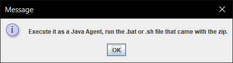
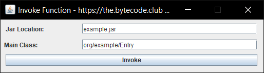

# JVM Sandbox
JVM Sandbox - Utilize Java Agents and ASM to manipulate then override Java SE classes.

**Just a simple POC to block Runtime.exec for any Java jar**

# 💡 Requirements
+ Java Runtime 1.8 **or higher**

## ⚙️ How To Use
1) Download the zip file containing the jar and .bat/.sh files.
2) Click the .bat or .sh depending on your OS
3) Import the jar you wish to sandbox/debug
4) Enter the main and method class it'll invoke
5) If you want to just test to see if it works, run the test.jar class.

# 🔑 Features:
+ Blocks all Runtime.exec calls
+ Blocks the process builder
+ Blocks awt.Robot
+ Can block JNI (LOL, breaks classloading)

# 📚 Resources
* [Website](https://konloch.com/JVM-Sandbox/)
* [Discord Server](https://discord.gg/aexsYpfMEf)
* [Download Releases](https://github.com/Konloch/JVM-Sandbox/releases)

# 👨‍💻 Disclaimer
+ This is a demo / experiment / proof of concept.
+ This was last modified on January 27th, 2015.
